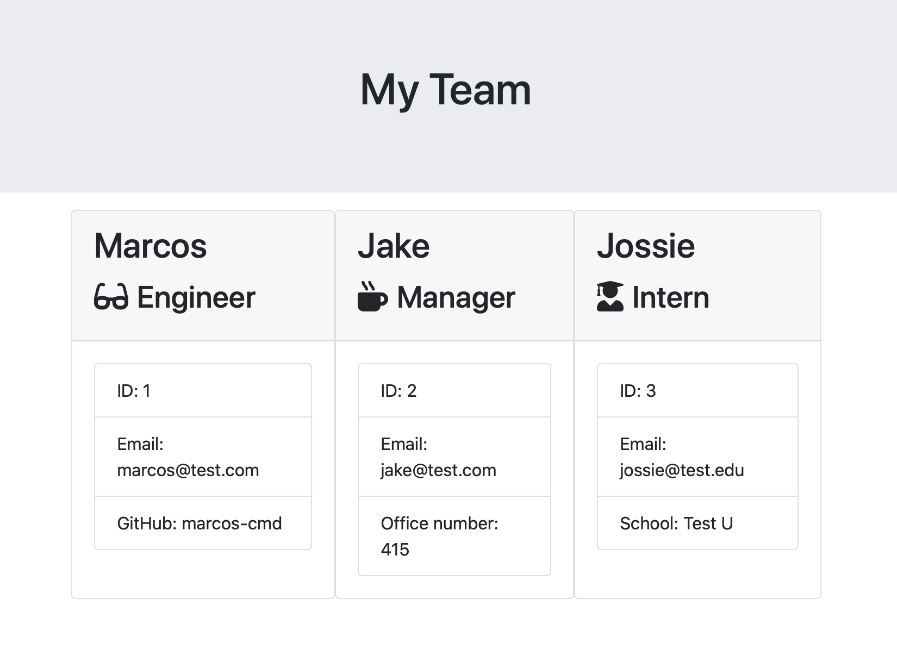

# Template Engine - Employee Summary

## Description

This node CLI application allows someone on a team to generate a summary of contact information for a team they are on. 

## Installation

Run `npm install` to install all necessary dependencies

## Usage

 1. Run `node apps.js` to begin the application's questionnaire
 2. Enter the number of employees you would like to add to your team
 3. Enter the employee's name > `ENTER`
 4. Enter given employee ID Number > `ENTER`
 5. Enter the employee's email > `ENTER`
 6. Select the employee's title > `ENTER`
 7. If you selected Engineer, input their GitHub. If you selected Manager, input their office number. If you selected Intern, input their school
 8. Repeat for all employees until you receive the "Success!" notification. 
 9. Open `output` folder, open `team.html` in a web browser. This is the summary of your team with easy access too important contact information.

## Preview Application
Example CLI:

Expected Output:
